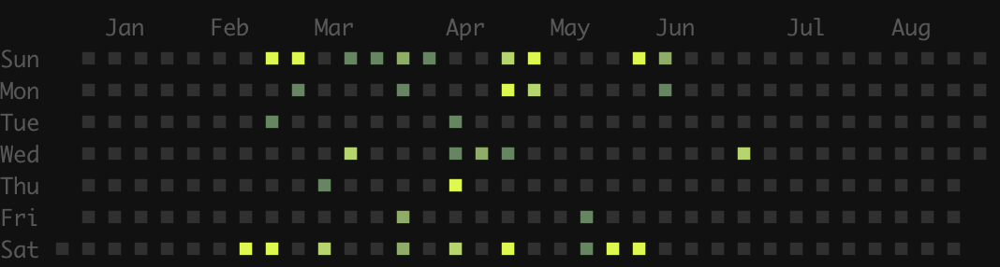

If you made it here you might have already read my previous post [24 hours of game development in Rust](/posts/24-hours-of-rust-game-dev), but if you haven't, it was basically a short summary of how I started learning rust and decided to make a game with it. I started with a classical OOP/trait architecture that was taking me nowhere really fast, so I switched to ECS and got a minimal prototype working. Fast forward 6 months, I wanted to catch you folks up on where I am and what I've learnt so far.

## Statistics 
Let's start with some stats:
- first commit: __*Sat Feb 9 12:57:17 2019*__
- longest streak: __*3 days*__
- total commits: __*370 commits*__
- max commits a day: __*35 commits*__

And a nice contribution graph generated with [git-stats](https://github.com/IonicaBizau/git-stats).

As you can see most of the work hapenned on weekends (which is not at all unusual given this is a side project 😉). And you will also notice there is a bit of a gap towards the end, and there's a good reason for that which I'll cover later!

## Demo!
Without further ado, let's see where the game is at right now!

<iframe 
    width="560" 
    height="315" 
    margin="auto" 
    src="https://www.youtube.com/embed/96qPwvDEAuI" 
    frameborder="0" 
    allow="accelerometer; autoplay; encrypted-media; gyroscope; picture-in-picture" 
    allowfullscreen
></iframe>

## Features
- 💵money: every item costs money and the money is substracted when buying an item
- 👟tennis courts of all types: hard, clay, concrete and grass
- 🎁more object types: benches, balls, roof tiles
- ⏱️time: the game keeps track of how many days/months/years it's been
- 🌶️main menu
- 🏠build menu
- ⛹️player selection menu
- ↩️assignments: a player can be assigned to a court or a bench
- 🛣️basic pathfinding: a player can find its way to an assigned court or bench
- 📈skill levels: a player playing on a court will get increased tennis skill level
- 🛌needs: a player who plays too much will get tired and need rest

## What I learnt
I've learnt many things in these 6 month about various aspects of this, so I figured I'd share it with you and maybe you can apply it to your own side projects/games. 

### Consistency is key
Even though that contribution graph looks pretty random, you'll notice I *always* did something over the weekend, I think there are only 2 weekends in which I didn't. And that has been absolutely key so far. I've had a lot of side projects before this but they had been much more hit and miss because I lacked consistency. So my advice would be to find a time and a place which you dedicate to your project and stick to it, it worked for me!

### Start small (Being a PM is hard)
I started with a grand vision for this game, I wanted to make the next Zoo Tycoon/Cities Skylines with pixel art and a tennis theme. I slowly had to convice myself that if I really wanted to ship this game (which I do), that scope would be too big for one person. Coming up with requirements is hard! I was designing a grand system with complex interactions and it took me some time to realize this (hence the gap towards the right of the contribution graph). But, the simplification is well underway and I expect to be back coding soon once the new plan has been solidified. So my advice to you all: start small and don't bite more than you can chew.

### Plan ahead
On the weekends I usually had lot of uninterrupted focus time so I was able to get on with meaty tasks that involved design, coding and art. But during the week days I only had one or two hours at a time. The first few times I sat down to do something on a week day I pretty much managed to get into the context and by the time I got focused it was time to go to bed. I learned that I needed to plan ahead and have a set of bite sized tasks that I could pick up during weekdays that would make the most out of those small time chucks. Art ended up being really good for this, and also small config changes, small refactors, more tests, etc. My advice is to keep a healthy backlog that you can refer to and choose according to how much time you have available.

### Community helps
I am super grateful for all the amazing rust game dev folks on twitter who I'd had a chance to follow and get inspired from, but who have also been very supportive. I didn't use to tweet much but I started tweeting commit logs of every release and it was amazing to see positive reactions. Not to mention the blog posts! I'd recommend getting involved in some community because odds are they will have the same challenges you're having or at least they'll be able to provide some fresh ideas.

### Making a game is hard
I was coding away one day and I started thinking: why would anyone play this? What makes games fun? I still don't have an amazing answer, I'll settle for the rust geeks playing it as an act of support for the ecosystem but it really got me thinking. I got most of the way through Scott Rogers' [Level Up: The Guide to Great Video Game Design](https://amzn.to/2KYBBZd) and it gave me a lot of inspiration and thoughts on what goes into making a game, why people play and how you need to make your audience feel something that they normally don't feel. Like for example when you play Cities Skylines you feel like you are an amazing businessman/woman because you are managing insane amounts of money, or maybe you like the influence you have over the policies and people living in your city, etc. It's a really good read, I don't think this level of dive-deep it necessarily required for someone making a game as a hobby, but I'd highly recommend it if you need a break from the execution.

### ECS is amazing once you can think in ECS
At the end of the last blog post I was conviced ECS was a nice pattern, but I wasn't sure exactly how all that was going to work out once the game got more complex. What I've learnt is that it takes a while to get used to thinking in ECS. It's a bit like when you start learning rust and you fight the borrow checker, then you realize you're thinking about it in the wrong way and you correct and all of a sudden everything is great. ECS was a bit like that too! I have a great example which will follow in a future blog post, but basically if you are using ECS bear with it and if something feels too hard it's because you're doing it wrong. 

### Separate config from code
Classic good code sort of behaviour, but I feel like this is even more important in a game where it can be tricky to tell what is config and what is core logic. One good example are my tennis courts. The logic between all courts is exactly the same and I have a json config that takes care of using different assets for different court materials (clay/grass/etc.). This mechanism allows me to easily add new items and I can now technically add different materials to all types of items while sharing the core logic (wodden bench vs metal), etc.

### Expect to put effort into your GUI
When people think of the game they mostly think of the cool graphics and action, but they ignore the buttons that help you get any gameplay at all. Or even the splashscreen you take for granted. I was quite shocked at the amount of effort that went into my GUI and let's be honest it's far from perfect. So think about that carefully because if you get that wrong no one will figure out how to play your game.

## Conclusions
The last 6 months have been awesome, I've learnt a lot, I've made a lot of mistakes and got a few things right, but most of all I had A LOT of fun. Now to plan for the next 3 months! 👟